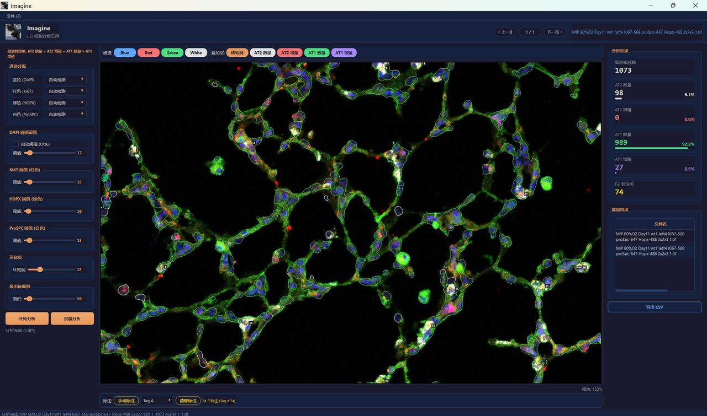

<p align="center">
  
</p>

<h1 align="center">Imagine</h1>

<p align="center">
  <b>智能荧光显微镜细胞计数工具</b><br>
  <i>Intelligent Fluorescence Microscopy Cell Counter</i>
</p>

<p align="center">
  
  
  
  
  
</p>

---

## 目录

- [简介](#简介)
- [界面预览](#界面预览)
- [通道自动识别](#通道自动识别)
- [功能特性](#功能特性)
  - [自动分析策略](#自动分析策略)
  - [核心算法](#核心算法)
  - [批量分析](#批量分析)
  - [多色标注系统](#多色标注系统)
- [安装与使用](#安装与使用)
- [快捷键](#快捷键)
- [参数说明](#参数说明)
- [支持的文件格式](#支持的文件格式)
- [技术栈](#技术栈)
- [系统要求](#系统要求)
- [更新日志](#更新日志)
- [开发背景](#开发背景)
- [许可证](#许可证)
- [致谢](#致谢)

---

## 简介

**Imagine** 是一款专为生物学研究者设计的桌面应用程序，用于自动化分析荧光显微镜图像中的细胞计数与共定位分析。支持 Zeiss `.czi` 和 `.tif/.tiff` 格式。

**全中文界面、零代码操作、开箱即用** — 下载解压即可运行，无需安装 Python 或任何编程环境。

### 为什么选择 Imagine？

| 传统工具 (Fiji/ImageJ) | Imagine |
|:---|:---|
| 英文界面，需要查阅文档 | **全中文界面**，所有菜单、按钮、提示均为中文 |
| 批量处理需编写宏脚本 | **一键批量处理**，选择文件夹或已打开文件即可 |
| 参数调节需要命令行或对话框 | **滑块式参数调节**，拖动即可实时预览 |
| 多策略分析需多次手动操作 | **自动策略识别**，根据文件名智能选择分析方案 |
| 结果需手动记录到 Excel | **一键导出 CSV**，自动汇总所有结果和参数 |
| 安装配置复杂（Java 环境等） | **解压即用**，单文件夹部署，无任何依赖 |

---

## 界面预览

<p align="center">
  
</p>

**深色主题 + 三栏布局**，自适应 16:9 屏幕比例：

- **左侧栏**：通道分配、阈值调节、分析按钮
- **中央区域**：图像查看（缩放/平移）、通道切换、叠加层控制、底部标注工具栏
- **右侧栏**：分析结果、批量结果表格、CSV 导出

### 交互设计亮点

- **16:9 自适应**：窗口大小根据屏幕分辨率自动调整
- **所见即所得**：切换通道、调整叠加层时，图像实时更新且保持缩放位置
- **符合直觉的操作**：滚轮缩放、左键拖拽平移、右键标注
- **文件列表管理**：点击 `N/M` 按钮弹出文件列表，可快速跳转或关闭文件
- **动态自适应**：界面控件根据文件内容自动显示/隐藏
- **Ctrl 多选**：打开文件时支持多选，一次导入多张图片
- **键盘导航**：`←` `→` 快速切换上/下一张

---

## 通道自动识别

Imagine 从文件名中**自动扫描**通道关键词，文件名的其他部分（实验条件、样本编号等）可以随意命名，不影响识别。只要文件名中包含以下关键词即可：

| 关键词格式 | 通道颜色 | 示例 |
|:---|:---|:---|
| `标记物-568` | 红色 | `Ki67-568`、`CD45-568`、`aSMA-568` |
| `标记物-647` | 白色 | `proSpc-647`、`proSPC-647` |
| `标记物-488` | 绿色 | `Hopx-488`、`CD31-488`、`GFP` |
| `DAPI` | 蓝色 | 始终作为核染色通道 |

### 示例

```
MIP 80%O2 Day11 wt1 left4 Ki67-568 proSpc-647 Hopx-488 2x2x3 1.czi
                           ~~~~~~~~ ~~~~~~~~~~~ ~~~~~~~~
                           红色通道   白色通道     绿色通道
```

```
随意前缀都行 CD45-568 CD31-488 DAPI 后面也随意.czi
              ~~~~~~~~ ~~~~~~~~ ~~~~
              红色通道   绿色通道  蓝色通道
```

> 程序只提取 `XXX-568`、`XXX-647`、`XXX-488`、`DAPI` 这些关键词，前后的内容完全不限。导入后左侧面板自动更新通道标签（如 `红色 (CD45)`）。
>
> 已知标记物（Ki67、ProSPC、HOPX）还会自动匹配分析策略（AT1/AT2 数量和增殖）。

---

## 功能特性

### 自动分析策略

根据检测到的标记物组合，自动选择适用的分析方案：

| 分析类型 | 所需标记 | 计算内容 |
|:---|:---|:---|
| **AT2 数量** | ProSPC + DAPI | ProSPC⁺ 细胞计数（胞质环检测） |
| **AT2 增殖** | ProSPC + Ki67 + DAPI | Ki67⁺ProSPC⁺ / ProSPC⁺ |
| **AT1 数量** | HOPX + DAPI | HOPX⁺ 细胞计数（滤波核内检测） |
| **AT1 增殖** | HOPX + Ki67 + DAPI | Ki67⁺HOPX⁺ / HOPX⁺ |

> 如果文件无匹配策略，则不显示多余的策略界面，保持简洁。

### 核心算法

- **DAPI 核分割**：高斯模糊 → Triangle/Otsu 双算法自动阈值 → 形态学开运算去噪 → 填洞 → 分水岭分离粘连核
- **AT1 核内检测**：HOPX 为核转录因子，信号在核内。中值滤波去噪后计算核内均值
- **AT2 胞质环检测**：ProSPC 为胞质标记，膨胀核区域生成环形 ROI，计算环内信号强度
- **Ki67 去噪**：中值滤波预处理消除染色杂点和浮色，减少假阳性
- **双阳性判定**：两个通道均经中值滤波后独立计算核内均值，双通道均超阈值才判定为阳性
- **向量化优化**：使用 `np.bincount` 和 bbox 局部处理，单张图像分析 < 1 秒

### 批量分析

- **已打开文件批量分析**：导入多张文件后，点击"批量分析"一键分析全部
- **文件夹批量处理**：`Ctrl+B` 选择文件夹，自动处理其中所有 `.czi` / `.tif` 文件
- 结果表格支持**双击跳转**查看对应图像
- **右键菜单**：删除单条结果或清空全部
- CSV 导出自动适配列，并附带完整分析参数

### 多色标注系统

标注工具位于图像下方独立工具栏：

| 标签 | 颜色 | 标签 | 颜色 |
|:---|:---|:---|:---|
| Tag A | 金色 | Tag D | 蓝色 |
| Tag B | 红色 | Tag E | 绿色 |
| Tag C | 青色 | Tag F | 紫色 |

- 右键点击添加/删除标注点 | `Ctrl+Z` 撤回 | `Ctrl+S` 导出为 Fiji 兼容 TIF

---

## 安装与使用

### 方法一：直接下载（推荐）

1. 从 [Releases](../../releases) 页面下载最新版本
2. 解压到任意目录
3. 双击 `Imagine.exe` 运行

> **无需安装 Python 或任何依赖，解压即用。**

### 方法二：从源码运行

```bash
git clone https://github.com/jiadizhunine/imagine-cell-counter.git
cd imagine-cell-counter
pip install -r requirements.txt
python cell_counter.py
```

### 方法三：从源码打包

```bash
pip install pyinstaller
pyinstaller --onedir --windowed --name Imagine --icon=imagine.ico --add-data logo.png;. cell_counter.py
```

---

## 快捷键

| 快捷键 | 功能 | 快捷键 | 功能 |
|:---|:---|:---|:---|
| `Ctrl+O` | 打开文件 | `Ctrl+S` | 导出标注 TIF |
| `Ctrl+B` | 批量处理文件夹 | `Ctrl+Z` | 撤回标注 |
| `Ctrl+R` | 开始分析 | `←` `→` | 上/下一张 |
| `Ctrl+E` | 导出 CSV | 滚轮 / 左键拖拽 | 缩放 / 平移 |

## 参数说明

| 参数 | 默认值 | 说明 |
|:---|:---|:---|
| DAPI 阈值 | 自动 (Triangle/Otsu) | 核分割阈值，自动模式取两种算法的较优值 |
| 红色/绿色/白色阈值 | 15 / 10 / 15 | 对应通道的信号强度判定阈值（0-255） |
| 环宽度 | 15 px | AT2 胞质信号检测的环形区域宽度 |
| 最小核面积 | 50 px | 过滤过小的噪声区域 |

## 支持的文件格式

| 格式 | 读取 | 写入 | 通道自动识别 | Fiji 标注 |
|:---|:---:|:---:|:---:|:---:|
| Zeiss CZI | ✅ | — | ✅ (元数据 + 文件名) | — |
| TIFF / TIF | ✅ | ✅ | ✅ (文件名) | ✅ (ImageJ ROI) |

## 技术栈

- **GUI**: PyQt5 (Fusion 风格 + 自定义深色主题)
- **图像处理**: scikit-image (分水岭分割, 形态学), scipy (距离变换, 中值滤波)
- **数值计算**: NumPy (向量化运算)
- **文件格式**: czifile (Zeiss CZI), tifffile (TIFF/ImageJ)
- **打包**: PyInstaller (单文件夹部署)

## 系统要求

- **操作系统**: Windows 10 / 11 (64-bit)
- **内存**: 建议 4GB 以上
- **磁盘**: 约 90MB（压缩包）

## 更新日志

### v1.2.3 (2026-03-26)

- **HOPX 三级门控**：raw 阈值 + 形态学重建背景校正 + 环对比滤波，大幅减少假阳性
- **Otsu 回显**：自动阈值计算结果显示在界面上，方便确认
- **增殖率公式修正**：双阳性 / 标记阳性，计算逻辑修复
- **标注保存修复**：标注点正确保存和加载
- **Bug 全面审查修复**：多项边界情况和显示问题修复

### v1.2.1 (2026-03-26)

- **界面截图**：README 使用实际程序截图替代 ASCII 示意图
- **文件命名规范**：README 详细说明文件名格式和通道识别规则

### v1.2.0 (2026-03-26)

- **AT1 检测优化**：HOPX 为核转录因子，采用中值滤波 + 核内均值检测
- **Ki67 去噪**：双阳性判定前中值滤波，减少染色杂点假阳性
- **已打开文件批量分析**：开始分析旁新增"批量分析"按钮
- **16:9 屏幕自适应**：窗口大小根据屏幕分辨率自动调整
- **文件名通道解析**：从文件名中的 `标记物-波长` 字段自动识别通道
- **文件列表管理**：N/M 按钮弹出文件列表，支持跳转和关闭
- **标注工具栏**：移至图像下方 | 导出 TIF 移至文件菜单

### v1.1.0 (2026-03-26)

- 多色标注标签、多文件选择、右键删除批量结果、CSV 导出参数、缩放位置保持

## 开发背景

本项目源于肺部发育生物学研究中对 AT1/AT2 肺泡上皮细胞的定量分析需求。设计目标是让**不会编程的生物学研究者**也能独立完成从图像分析到数据导出的完整流程，无需依赖生物信息学支持。

## 许可证

本项目采用 [MIT License](LICENSE) 开源协议。

## 致谢

- [scikit-image](https://scikit-image.org/) — 图像分割算法
- [PyQt5](https://www.riverbankcomputing.com/software/pyqt/) — 图形界面框架
- [Fiji/ImageJ](https://fiji.sc/) — ROI 格式兼容性参考
